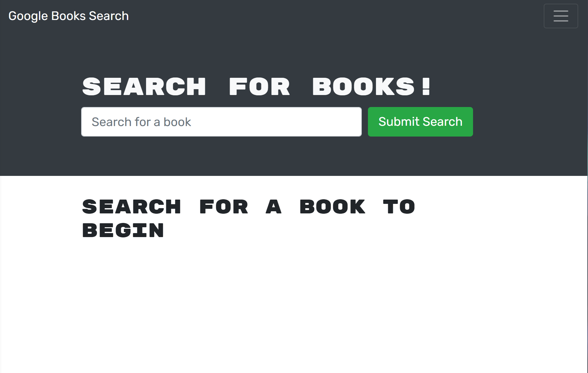

# Fetch Me a Book

## Table of Contents 
- [Description](#description)
- [Purpose](#purpose)
- [Installation](#installation)
- [Built With](#built-with)
- [License](#license)
- [Contribution](#contribution)
- [Contact Info](#contact-info)

## Description

Fetch Me a Book is a GraphQL MERN stack application that challenged me to change it from traditional RestfulAPI routes. The functionality of searching, saving, and removing favorite books was already installed in the application.

## Purpose

The purpose of this application was to show my skills in how I can refactor a RestfulAPI route application into using GraphQL API using with an Apollo Server.

## Installation

This app is already deployed to Herkou but these steps will instruct on how it can be installed.

* Clone the git repository to your own machine.
* Run `npm i` or `npm install` in the command line to install all needed packages.
* Run `npm run develop` to run the React application as it should open in your default browser.

[Deployment Link](https://nameless-garden-57789.herokuapp.com/)

## Built With

* JavaScript
* ES6
* Express.js
* Mongoose.js
* MongoDB
* Node.js
* React
* Apollo Server
* GraphQL
* Herkou

## License

## Contribution

©️2022 Holdan McMullen

## Contact Info:
  
- Github: [draxion2](https://github.com/draxion2)
- Email: holdanmcmullen@gmail.com
